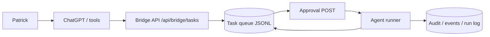

# Cheeky OS — Persistent Agent Orchestration (v1.1)

Structured **Task Objects**, a JSONL queue, a **safety layer** (risk, execution rate limit, audit), a **manual-first bridge API**, and an **optional background processor** live under `email-intake/cheeky-os/agent/` and `routes/`. All durable files are under **`email-intake/cheeky-os/data/`**. Nothing auto-deploys, pushes git, or sends outbound email; shell execution is whitelist-only in `agentRunner.js`.

Patrick (or any client) can submit work through HTTP, approve it, run it once, or temporarily enable the processor for overnight-style **sequential** execution of already-approved tasks — still bounded by the same risk and rate limits.

## Architecture



**Flow in words:** Patrick → ChatGPT (orchestration) → Bridge API → Task queue → human **Approval** → Agent runner (manual `/run` or optional processor tick) → persisted result + audit trail.

## Task object reference

| Field | Type / notes |
|-------|----------------|
| `taskId` | String, generated by `taskSchema.createTask` |
| `intent` | `build` \| `query` \| `execute` \| `notify` (unsupported → safe error) |
| `target` | String (script name, command prefix, or descriptor) |
| `requirements` | **Non-empty** string array; for `build`, exact `npm run build`, `npm run lint`, or `npm test` entries opt into those commands |
| `approvalRequired` | Boolean; **`safetyGuard.assessRisk` sets this true for `high` risk** (e.g. `critical` priority, `execute` intent) |
| `priority` | `low` \| `normal` \| `high` \| `critical` |
| `status` | `pending` → `approved` \| `rejected`, or `running` → `completed` \| `failed` |
| `createdAt` / `updatedAt` | ISO-8601 |
| `completedAt` | ISO or null |
| `result` | Object or null (runner output) |
| `errorLog` | String or null |
| `requestedBy` | String (default `patrick`) |

## Example curls

Create (must include ≥1 requirement string):

```bash
curl -s -X POST http://127.0.0.1:PORT/api/bridge/tasks \
  -H "Content-Type: application/json" \
  -d "{\"intent\":\"query\",\"target\":\"inventory-snapshot\",\"requirements\":[\"read-only diagnostic\"],\"requestedBy\":\"patrick\"}"
```

Approve and run manually:

```bash
curl -s -X POST http://127.0.0.1:PORT/api/bridge/tasks/TASK_ID/approve -H "Content-Type: application/json" -d "{}"
curl -s -X POST http://127.0.0.1:PORT/api/bridge/tasks/TASK_ID/run -H "Content-Type: application/json" -d "{}"
```

Status dashboard:

```bash
curl -s http://127.0.0.1:PORT/api/agent/status
```

## Example build task JSON

High-priority implementation request (risk may force `approvalRequired` when combined with critical/high rules):

```json
{
  "intent": "build",
  "target": "graph-email-connector",
  "requirements": [
    "Create graphMailPoller.js",
    "Poll inbox every 5 minutes",
    "Transform messages into voice payloads"
  ],
  "priority": "high",
  "requestedBy": "patrick"
}
```

Unless requirements list the **exact** strings `npm run build`, `npm run lint`, or `npm test`, the runner **logs only** and does not run npm (no surprise builds).

## Approval workflow

1. `POST /api/bridge/tasks` — task is `pending`; high-risk tasks get `approvalRequired: true`.
2. `POST /api/bridge/tasks/:id/approve` — moves to `approved` (only from `pending`).
3. `POST /api/bridge/tasks/:id/run` — **only if `approved`**; checks **10 executions/hour**; runs `runTask`; records audit + execution slot.
4. `POST …/reject` with `{ "reason": "…" }` — `rejected`, reason on `errorLog`.

## Overnight simulation workflow

1. Create and approve **several** tasks (each must pass your operational rules).
2. Set **`AGENT_PROCESSOR_ENABLED=true`** and optionally `AGENT_PROCESSOR_INTERVAL_MS=10000`.
3. Restart Cheeky OS — processor drains **one approved task per tick**, oldest first, with a single-task lock.
4. Confirm `cheeky-os/data/processor-status.json` heartbeat moves, `audit-trail.jsonl` shows `task_started` / completed/failed from actor `processor`.
5. Restore **`AGENT_PROCESSOR_ENABLED=false`** and restart when done.

## Audit trail

Append-only JSONL: **`email-intake/cheeky-os/data/audit-trail.jsonl`**. Each line: `eventType`, `taskId`, `actor`, `timestamp`, `metadata`. Events include: `task_created`, `task_approved`, `task_rejected`, `task_started`, `task_completed`, `task_failed`, `rate_limit_hit`.

## Processor enable instructions

Default is **OFF**. In `.env` (see `email-intake/.env.example`):

- `AGENT_PROCESSOR_ENABLED=false` — keep this for normal operation.
- `AGENT_PROCESSOR_ENABLED=true` — enables the interval loop only after server listen.
- `AGENT_PROCESSOR_INTERVAL_MS=30000` — minimum effective interval 5000 ms in code.
- `AGENT_TASK_TIMEOUT_MS=600000` — runner subprocess cap.

## Safety model

- **Risk:** `critical` priority, `execute` intent → **high**; `build` → **medium**; more than five requirements bumps one level. **High → `approvalRequired` forced on create.**
- **Rate limit:** max **10 task executions per rolling hour** (`rate-limit.json`), enforced before **manual** `/run` and inside the **processor**.
- **Execute:** only prefixes `npm run `, `node `, `npx prisma `; rejects `rm`, `del`, `sudo`, `git push`, `deploy`, `&&`, `||`, `;`.
- **No** auto deploy, git push, email send, Square/Dataverse mutation from this layer.

## Related files

| Path | Role |
|------|------|
| `agent/taskSchema.js` | `createTask` |
| `agent/taskQueue.js` | JSONL queue + file bootstrap |
| `agent/agentRunner.js` | `runTask` |
| `agent/safetyGuard.js` | `assessRisk`, `rateLimitCheck`, `recordExecution`, `auditLog` |
| `agent/taskProcessor.js` | Optional `startProcessor` / `processNextApprovedTask` |
| `routes/bridgeTasks.js` | `/api/bridge/tasks*` |
| `routes/agentStatus.js` | `GET /api/agent/status` |
| `data/*.jsonl` | queue, events, audit, run log, notifications |
| `data/rate-limit.json` | execution timestamps |
| `data/processor-status.json` | heartbeat |

## Agent Mesh v2.0 (transport + adapters + memory + subagents)

Patrick → ChatGPT → **`POST /api/transport/task`** (header `x-cheeky-transport-key` matching `CHEEKY_TRANSPORT_KEY`) → rule-based **`bridge/taskTranslator.js`** optional → validated task → queue / audit (**no auto-run**).

- **Transport routes:** `/api/transport/task`, `/api/transport/status`, `/api/transport/logs` → `transport-log.jsonl`
- **`agents/agentRouter.routeTask`** — cursor/codex **dry-run** plans for `build`, whitelisted `shellAdapter` validation for `execute`, internal `notify`/`query` via runner (read-only mocks / local JSONL enqueue only).
- **Memory:** `memory/taskMemory.js`, `memory/memoryIndexer.js`, `memory/memorySearch.js` → `task-memory.jsonl`, `task-memory-index.json`; completed/failed/rejected tasks append after bridge `/run` / processor (**additive** hooks).
- **Subagents** (`subagents/*.js`): diagnostics, memory search, inbound JSON read, orchestration counts, repo `data/` JSON **read-only** Square/job hints (**no mutations**).

